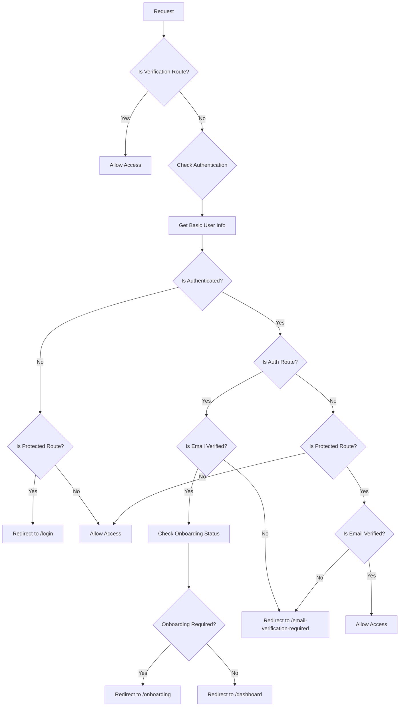
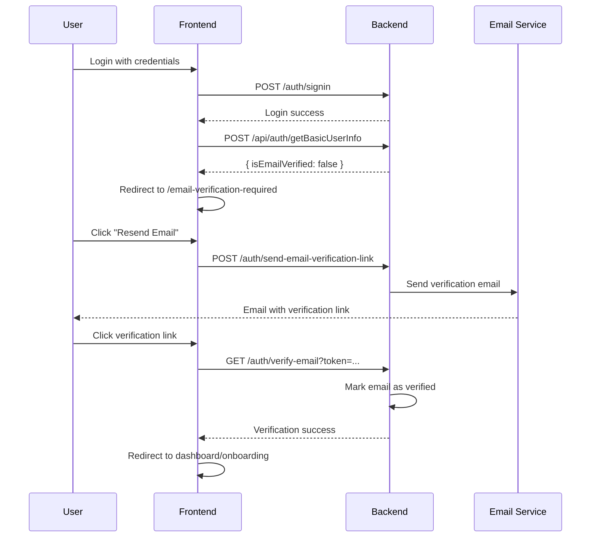

# Authentication Flow Documentation

## Overview

This document describes the complete authentication and routing flow for the Heartly application, including SuperTokens integration, email verification, and middleware-based route protection.

## Table of Contents

- [Authentication Architecture](#authentication-architecture)
- [Route Protection System](#route-protection-system)
- [Email Verification Flow](#email-verification-flow)
- [User Journey Flows](#user-journey-flows)
- [Implementation Details](#implementation-details)
- [API Endpoints](#api-endpoints)
- [Components and Pages](#components-and-pages)
- [Troubleshooting](#troubleshooting)

## Authentication Architecture

### SuperTokens Integration

The application uses SuperTokens for authentication with the following configuration:

**Backend Configuration** (`supertokensInitConfig.ts`):
```typescript
appInfo: {
  appName: 'heartly',
  apiDomain: 'http://localhost:3001',
  websiteDomain: 'http://localhost:3000',
  apiBasePath: '/auth',
  websiteBasePath: '/auth',
}
```

**Frontend Configuration** (`app/supertokens/frontend.tsx`):
```typescript
appInfo: {
  appName: "heartly",
  apiDomain: "http://localhost:3001",
  websiteDomain: "http://localhost:3000", 
  apiBasePath: "/auth",
  websiteBasePath: "/auth",
}
```

### Session Management

- **Token Transfer**: Cookie-based session management
- **Session Persistence**: Configurable with remember-me functionality
- **Tenant Context**: Sessions include tenantId, role, and email in access token payload
- **Request Scoping**: Backend uses request-scoped SessionContextService

## Route Protection System

### Route Categories

The middleware categorizes routes into four types:

1. **Auth Routes** (`authRoutes`)
   - `/` (landing page)
   - `/login`
   - `/sign-up`
   - `/auth/*`

2. **Protected Routes** (`protectedRoutes`)
   - `/dashboard`
   - `/onboarding`

3. **Verification Routes** (`verificationRoutes`)
   - `/auth/verify-email`

4. **Email Verification Required Route**
   - `/email-verification-required`

### Middleware Logic Flow



### Route Protection Rules

| User Status | Auth Routes | Protected Routes | Verification Routes |
|-------------|-------------|------------------|-------------------|
| **Not Authenticated** | ✅ Allow | ❌ → `/login` | ✅ Allow |
| **Authenticated + Unverified** | ❌ → `/email-verification-required` | ❌ → `/email-verification-required` | ✅ Allow |
| **Authenticated + Verified + Onboarding Pending** | ❌ → `/onboarding` | ✅ Allow | ✅ Allow |
| **Authenticated + Verified + Onboarding Complete** | ❌ → `/dashboard` | ✅ Allow | ✅ Allow |

## Email Verification Flow

### Verification States

1. **Unverified User Login**
   - User logs in successfully
   - `getBasicUserInfo()` returns `isEmailVerified: false`
   - User redirected to `/email-verification-required`

2. **Verification Page Features**
   - Display user's email address
   - Resend verification email button
   - Sign out option
   - Auto-redirect when verification status changes

3. **Email Verification Process**
   - User receives email with verification link
   - Clicks link → redirected to `/auth/verify-email`
   - Backend processes verification
   - User redirected to appropriate page based on onboarding status

### Verification API Flow



## User Journey Flows

### New User Registration

1. **Sign Up** → `/sign-up`
2. **Account Created** → Automatic redirect based on verification status
3. **Email Verification Required** → `/email-verification-required`
4. **Verify Email** → Click link in email
5. **Onboarding** → `/onboarding` (for OWNER role)
6. **Dashboard** → `/dashboard` (after onboarding complete)

### Existing User Login

1. **Login** → `/login`
2. **Authentication Check** → Multiple possible redirects:
   - Unverified → `/email-verification-required`
   - Verified + Onboarding pending → `/onboarding`
   - Verified + Onboarding complete → `/dashboard`

### Email Verification Recovery

1. **Access Protected Route** → Automatic redirect to `/email-verification-required`
2. **Resend Email** → New verification email sent
3. **Verify Email** → Return to originally requested route

## Implementation Details

### Frontend Components

#### Login Form (`components/auth/Login-form.tsx`)
```typescript
const handleSubmit = async (event) => {
  const response = await signInUser(formData);
  const userInfo = await getBasicUserInfo();
  
  if (userInfo.isEmailVerified) {
    router.push("/dashboard");
  } else {
    router.push("/email-verification-required");
  }
};
```

#### Email Verification Page (`app/email-verification-required/page.tsx`)
- Displays user email
- Provides resend functionality
- Auto-redirects verified users
- Offers sign-out option

#### Custom Hooks
- `useEmailVerification()` - Check verification status
- `useRequiresEmailVerification()` - Boolean for conditional rendering
- `useSession()` - Enhanced session management with persistence

### Backend Services

#### Session Context Service (`session-context.service.ts`)
- Request-scoped service for session data
- Integrates with SuperTokens session container
- Provides tenant context (tenantId, role, email)

#### SuperTokens Configuration
- Enhanced session creation with tenant context
- Cookie-based session persistence
- Email verification integration
- Custom override functions for session handling

### Middleware (`middleware.ts` & `utils/supertokens/middleware.ts`)

The middleware performs these operations in order:

1. **Route Classification** - Determine route type
2. **Authentication Check** - Verify user session
3. **Email Verification Check** - Get verification status
4. **Auth Route Handling** - Redirect authenticated users
5. **Protected Route Handling** - Enforce verification requirements
6. **Onboarding Check** - Determine completion status

## API Endpoints

### Authentication Endpoints

| Endpoint | Method | Description |
|----------|--------|-------------|
| `/auth/signin` | POST | User login |
| `/auth/signup` | POST | User registration |
| `/auth/signout` | POST | User logout |
| `/auth/verify-email` | GET | Email verification |
| `/auth/send-email-verification-link` | POST | Resend verification email |

### User Information Endpoints

| Endpoint | Method | Description |
|----------|--------|-------------|
| `/api/auth/getBasicUserInfo` | POST | Basic user info (works for unverified users) |
| `/api/auth/getUserSession` | POST | Full user profile (requires verification) |

### Response Formats

#### Basic User Info Response
```typescript
{
  status: "OK",
  userId: string,
  email: string,
  isEmailVerified: boolean,
  tenantIds: string[]
}
```

#### Sign In Response
```typescript
{
  status: "OK" | "WRONG_CREDENTIALS_ERROR",
  user?: {
    id: string,
    emails: string[],
    loginMethods: [{
      email: string,
      verified: boolean,
      // ... other fields
    }]
  }
}
```

## Components and Pages

### Key Pages

- **`/login`** - Login form with verification handling
- **`/sign-up`** - Registration form
- **`/email-verification-required`** - Verification pending page
- **`/auth/verify-email`** - Email verification handler
- **`/dashboard`** - Main application dashboard
- **`/onboarding`** - New user onboarding flow

### Provider Setup

```typescript
// app/providers.tsx
<HeroUIProvider>
  <SessionProvider>
    <UserProvider>
      <FacilityProvider>
        <DrawerProvider>
          {children}
        </DrawerProvider>
      </FacilityProvider>
    </UserProvider>
  </SessionProvider>
</HeroUIProvider>
```

### SuperTokens Initialization

```typescript
// components/supertokens/superTokensInit.tsx
if (typeof window !== "undefined") {
  SuperTokensReact.init(frontendConfig());
}
```

## Troubleshooting

### Common Issues

#### 1. CORS Errors
**Problem**: SuperTokens requests failing with CORS errors
**Solution**: Ensure CORS is configured before SuperTokens middleware in `main.ts`

```typescript
// CORRECT order
app.enableCors({ ... });
app.use(middleware()); // SuperTokens middleware
```

#### 2. Session Context Undefined
**Problem**: `SessionContextService` not available in middleware
**Solution**: Use `ModuleRef.resolve()` for request-scoped services

```typescript
const sessionContextService = await this.moduleRef.resolve(SessionContextService);
```

#### 3. Redirect Loops
**Problem**: Users stuck in redirect loops
**Solution**: Check middleware route classification and ensure proper exclusions

#### 4. Email Verification Not Working
**Problem**: Verification emails not sending or links not working
**Solution**: 
- Verify backend email configuration
- Check SuperTokens dashboard configuration
- Ensure proper domain settings in `appInfo`

### Debug Information

Enable debug logging in development:

```typescript
// Frontend
console.log("User info:", userInfo);
console.log("Session state:", sessionState);

// Backend  
console.log("Session context:", sessionContext);
console.log("User tenant context:", tenantContext);
```

### Environment Variables

Required environment variables:

```env
# Backend
SUPERTOKENS_API_KEY=your_api_key
NODE_ENV=development

# Frontend
NEXT_PUBLIC_NEST_API_URL=http://localhost:3001
```

## Security Considerations

1. **Cookie Security**: Secure cookies in production, HttpOnly enabled
2. **CORS Configuration**: Restrictive origin policies
3. **Session Validation**: Server-side session verification
4. **Route Protection**: Middleware-enforced access control
5. **Email Verification**: Required for sensitive operations
6. **Tenant Isolation**: Multi-tenant session context

## Performance Optimizations

1. **Session Persistence**: Cookie-based sessions reduce server load
2. **Request Scoping**: Efficient memory usage with request-scoped services
3. **Middleware Caching**: Preflight request caching (24 hours)
4. **Smart Redirects**: Minimal API calls for route decisions

---

## Conclusion

This authentication system provides a robust, secure, and user-friendly experience with proper email verification, route protection, and session management. The middleware-based approach ensures consistent behavior across the application while maintaining good performance and security practices.

For additional support or questions, refer to the SuperTokens documentation or contact the development team.